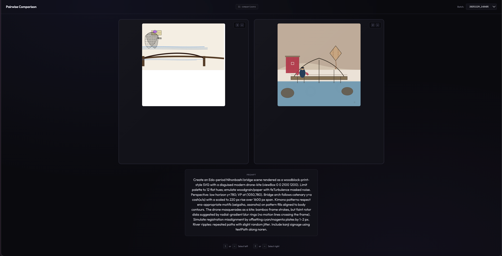

# LLM SVG Arena

Generating delightful SVGs has become an [important sidequest on the path to AGI]((https://simonwillison.net/2024/Oct/25/pelicans-on-a-bicycle/)). Supervised learning can certainly teach specialized models to become [very](https://arxiv.org/html/2412.11102v1) [good](https://omnisvg.github.io/), but superhuman comedic image generation will likely be achieved through RL.

This repository includes:
1. A curriculum of increasingly difficult prompts to generate SVGs for.
2. A UI for a human to quickly perform pairwise comparison of generated SVGs for the same prompt.
3. LLM as judge for pairwise comparison with a set of LLMs as judges
4. Statistics on ELO rankings, LLM to human and LLM to LLM agreement on choices.



## Results
After 300 pairs evaluated
```
============================================================
  SVG Model Rankings by Human ELO
============================================================
  Rank   Model                                         ELO
  ------ ---------------------------------------- --------
  1      gemini-3-pro-preview                       1764.2
  2      claude-sonnet-4-5-20250929                 1635.8
  3      claude-opus-4-1-20250805                   1557.6
  4      claude-haiku-4-5-20251001                  1534.8
  5      gpt-5.1-2025-11-13                         1491.0
  6      gpt-5-mini-2025-08-07                      1488.2
  7      gemini-2.5-flash                           1471.1
  8      gpt-5-codex                                1451.6
  9      gemini-2.5-flash-lite                      1318.2
  10     gpt-5-nano-2025-08-07                      1287.5

============================================================
  SVG Model Rankings by Judge Consensus ELO
============================================================
  Rank   Model                                         ELO
  ------ ---------------------------------------- --------
  1      gemini-3-pro-preview                       1709.0
  2      gpt-5.1-2025-11-13                         1624.2
  3      gpt-5-mini-2025-08-07                      1616.6
  4      gpt-5-codex                                1575.0
  5      claude-sonnet-4-5-20250929                 1539.9
  6      claude-opus-4-1-20250805                   1526.3
  7      claude-haiku-4-5-20251001                  1511.4
  8      gemini-2.5-flash                           1488.4
  9      gpt-5-nano-2025-08-07                      1274.2
  10     gemini-2.5-flash-lite                      1135.0

============================================================
  Judge Agreement with Human Judgments
============================================================
  Judge Model                            Agree    Total        %
  ----------------------------------- -------- -------- --------
  gemini-3-pro-preview                     205      289    70.9%
  claude-haiku-4-5-20251001                198      289    68.5%
  gpt-5-mini-2025-08-07                    188      289    65.1%
  gpt-5-nano-2025-08-07                    187      289    64.7%
  gemini-2.5-flash-lite                    187      289    64.7%
  gpt-5.1-2025-11-13                       186      289    64.4%
  claude-opus-4-1-20250805                 183      289    63.3%
  claude-sonnet-4-5-20250929               183      289    63.3%
  gemini-2.5-flash                         181      289    62.6%

 Pairwise Agreement Details:
  --------------------------------------------------
  gpt-5.1-2025-11-13 <-> gpt-5-mini-2025-08-0: 81.3% (235/289)
  gpt-5.1-2025-11-13 <-> gpt-5-nano-2025-08-0: 73.4% (212/289)
  gpt-5.1-2025-11-13 <-> claude-opus-4-1-2025: 72.0% (208/289)
  gpt-5.1-2025-11-13 <-> claude-haiku-4-5-202: 73.0% (211/289)
  gpt-5.1-2025-11-13 <-> claude-sonnet-4-5-20: 76.8% (222/289)
  gpt-5.1-2025-11-13 <-> gemini-2.5-flash: 73.4% (212/289)
  gpt-5.1-2025-11-13 <-> gemini-2.5-flash-lit: 76.8% (222/289)
  gpt-5.1-2025-11-13 <-> gemini-3-pro-preview: 72.0% (208/289)
  gpt-5-mini-2025-08-0 <-> gpt-5-nano-2025-08-0: 78.9% (228/289)
  gpt-5-mini-2025-08-0 <-> claude-opus-4-1-2025: 72.7% (210/289)
  gpt-5-mini-2025-08-0 <-> claude-haiku-4-5-202: 74.4% (215/289)
  gpt-5-mini-2025-08-0 <-> claude-sonnet-4-5-20: 78.2% (226/289)
  gpt-5-mini-2025-08-0 <-> gemini-2.5-flash: 74.7% (216/289)
  gpt-5-mini-2025-08-0 <-> gemini-2.5-flash-lit: 82.4% (238/289)
  gpt-5-mini-2025-08-0 <-> gemini-3-pro-preview: 77.5% (224/289)
  gpt-5-nano-2025-08-0 <-> claude-opus-4-1-2025: 65.4% (189/289)
  gpt-5-nano-2025-08-0 <-> claude-haiku-4-5-202: 69.2% (200/289)
  gpt-5-nano-2025-08-0 <-> claude-sonnet-4-5-20: 70.2% (203/289)
  gpt-5-nano-2025-08-0 <-> gemini-2.5-flash: 72.3% (209/289)
  gpt-5-nano-2025-08-0 <-> gemini-2.5-flash-lit: 73.7% (213/289)
  gpt-5-nano-2025-08-0 <-> gemini-3-pro-preview: 70.9% (205/289)
  claude-opus-4-1-2025 <-> claude-haiku-4-5-202: 78.2% (226/289)
  claude-opus-4-1-2025 <-> claude-sonnet-4-5-20: 77.9% (225/289)
  claude-opus-4-1-2025 <-> gemini-2.5-flash: 63.3% (183/289)
  claude-opus-4-1-2025 <-> gemini-2.5-flash-lit: 75.1% (217/289)
  claude-opus-4-1-2025 <-> gemini-3-pro-preview: 70.2% (203/289)
  claude-haiku-4-5-202 <-> claude-sonnet-4-5-20: 78.9% (228/289)
  claude-haiku-4-5-202 <-> gemini-2.5-flash: 66.4% (192/289)
  claude-haiku-4-5-202 <-> gemini-2.5-flash-lit: 76.8% (222/289)
  claude-haiku-4-5-202 <-> gemini-3-pro-preview: 74.0% (214/289)
  claude-sonnet-4-5-20 <-> gemini-2.5-flash: 70.2% (203/289)
  claude-sonnet-4-5-20 <-> gemini-2.5-flash-lit: 76.5% (221/289)
  claude-sonnet-4-5-20 <-> gemini-3-pro-preview: 75.1% (217/289)
  gemini-2.5-flash <-> gemini-2.5-flash-lit: 72.3% (209/289)
  gemini-2.5-flash <-> gemini-3-pro-preview: 74.4% (215/289)
  gemini-2.5-flash-lit <-> gemini-3-pro-preview: 75.8% (219/289)
```
## Installation

```bash
curl -LsSf https://astral.sh/uv/install.sh | sh  # install uv
uv sync                                           # install dependencies
```

## Configuration

### API Keys (`.env` or environment)

```bash
export OPENAI_API_KEY="..."
export ANTHROPIC_API_KEY="..."
export GOOGLE_API_KEY="..."
```

### Generation Models (`models_config.yaml`)

```yaml
models:
  - openai/gpt-5.1-2025-11-13
  - anthropic/claude-sonnet-4-5-20250929
  - google/gemini-2.5-flash

settings:
  max_workers: 4      # parallel model calls
  save_html: true     # generate HTML viewer
```

### Judge Models (`judges_config.yaml`)

```yaml
judges:
  - openai/gpt-5.1-2025-11-13
  - anthropic/claude-opus-4-1-20250805
  - google/gemini-2.5-flash

settings:
  max_workers: 10     # parallel judge calls
```

## Scripts

### 1. Generate Images (`batch_comp.py`)

Run all models in `models_config.yaml` against prompts in a CSV:

```bash
uv run batch_comp.py prompts.csv
uv run batch_comp.py prompts.csv --output-dir my_outputs
```

**Input:** CSV with `prompt` and `difficulty` columns  
**Output:** `batch_outputs/<timestamp>/` with PNG/SVG files and HTML viewer

### 2. Human Comparison (`compare_app.py`)

Flask app for pairwise human voting:

```bash
uv run compare_app.py
```

Opens at `http://localhost:5001`. Votes are saved to `comparisons.csv`.

### 3. LLM Judging (`llm_judge.py`)

Run LLM judges on human comparisons:

```bash
uv run llm_judge.py
uv run llm_judge.py --comparisons comparisons.csv --output judge_results.csv
```

Reads `comparisons.csv`, evaluates each pair with all configured judges, writes to `judge_results.csv`. Skips already-judged pairs on re-run.

### 4. Compute Statistics (`judge_stats.py`)

Analyze judge results and compute ELO rankings:

```bash
uv run judge_stats.py
uv run judge_stats.py --input judge_results.csv
```

Outputs:
- Human ELO rankings
- Judge consensus ELO rankings
- Human-judge agreement rates
- Inter-judge agreement matrix
